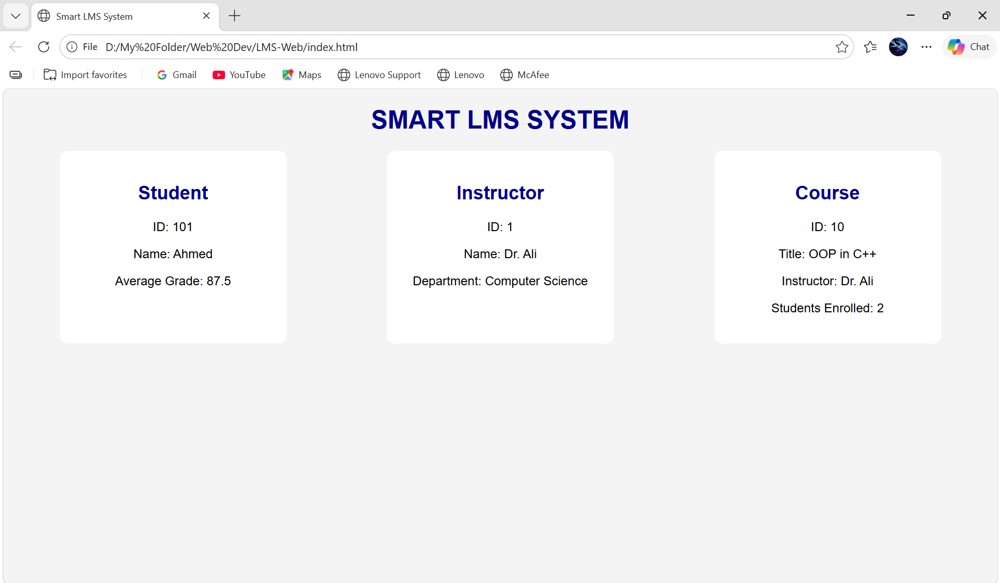

# Learning Management System (LMS)

A console-based Learning Management System built in C++ with a companion web interface. Manages students, instructors, and courses with full enrollment and grade tracking functionality.

## Screenshots



## Features

- Student, Instructor, and Course management via dedicated OOP classes
- Student enrollment and real-time grade tracking using STL vectors
- Persistent data across sessions
- Web interface built with HTML & CSS to visualize system flow

## Tech Stack

| Layer | Technology |
|-------|-----------|
| Core Logic | C++ |
| OOP Concepts | Inheritance, Polymorphism, Encapsulation |
| Data Management | STL Vectors |
| Web Interface | HTML, CSS |

## How to Run

### C++ Version
```bash
g++ -o lms "Cpp Version/main.cpp"
./lms
```

### Web Version
Open `LMS-Web/index.html` in any browser.

## What I Learned

- Designing class hierarchies with real-world relationships
- Managing dynamic data with STL containers
- Separating logic from presentation across two interfaces
